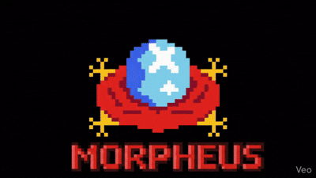
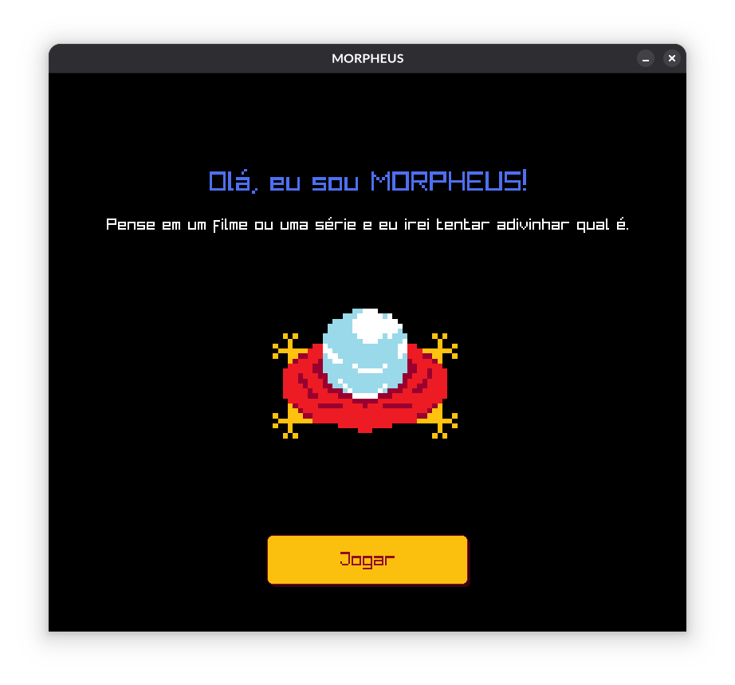

<div align="center">
  
</div>

<div align="center">
  
  
  
  
</div>

<br>

## 

**Morpheus** é um jogo interativo de adivinhação desenvolvido inteiramente na linguagem **C**. Inspirado no clássico Akinator, o programa atua como um oráculo focado no universo de filmes e séries. Ao iniciar o jogo, o Morpheus guiará o usuário através de perguntas de "Sim" ou "Não" para tentar deduzir o título que o jogador está pensando.

<div align="center">
  
</div>

A inteligência por trás do oráculo é baseada em uma **Árvore Binária de Decisão**. O projeto foi estruturado com uma semântica clara e eficiente, onde cada nó interno representa uma pergunta diagnóstica e as folhas (`sim` e `não`) representam os títulos finais das obras.

Este projeto foi desenvolvido como requisito acadêmico para a disciplina de **Estruturas de Dados II**, sob a orientação do docente **Alex Fernando de Araujo**.

## 

### 
* **Linguagem:** C padrão (`<stdio.h>`, `<stdlib.h>`, `<string.h>`).
* **Estruturas de Dados:** Árvores Binárias de Decisão, Structs Otimizados, Ponteiros e Alocação Dinâmica de Memória.
* **Lógica de Parsing:** Uso eficiente de `strtok` e `fgets` para processamento de base de dados.
* **Ambiente de Desenvolvimento:** GCC (GNU Compiler Collection) e Make.

### 
* **Interface Gráfica:** Raylib (biblioteca em C utilizada para a renderização visual, layout e interações do usuário).

## 

### 
Ter o compilador `gcc` e a ferramenta `make` e `git` instalados no seu sistema (ambientes Linux/Debian).

#### 
```bash
sudo apt update
sudo apt install build-essential
sudo apt install gcc make git
```
#### 


1.  Clone este repositório:
    ```bash
    git clone https://github.com/isamartins-engcomput/BIG.vp-AKINATOR-ArvoresED2.git
    ```
2.  Acesse a pasta principal do projeto (onde o arquivo Makefile está localizado):
    ```bash
    cd BIG.vp-AKINATOR-ArvoresED2
    ```
3.  Compile e execute o jogo com apenas um comando:
    ```bash
    make
    ```
    *(O script fará o download da biblioteca Raylib, realizará a compilação do código e abrirá a janela do jogo automaticamente).*

    ***Nota para usuários Linux:** O Makefile foi configurado para instalar as dependências gráficas do X11 e de áudio automaticamente na primeira execução. O terminal poderá solicitar sua senha (sudo) para o apt-get.*

<br>

## 

* Bruno Felix da Silva
* Gustavo Bossolan dos Santos
* Isadora de Souza Martins
* Pedro Lucas Lima Sperandio
* Vinicius Fonseca Santos Freitas

---
> *"Você toma a pílula azul, a história acaba, você acorda na sua cama e acredita no que quiser. Você toma a pílula vermelha, você fica no País das Maravilhas, e eu te mostro até onde vai a toca do coelho."* - Morpheus